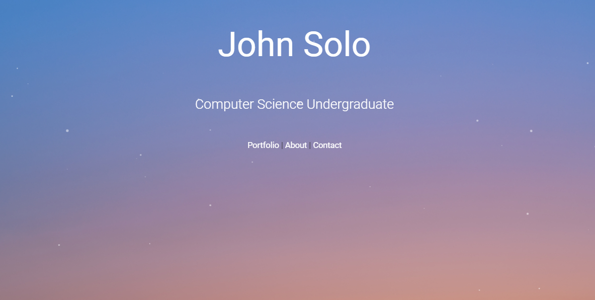

# johnsolojoseph.github.io :computer: :heartpulse:
A portfolio showcasing my programming projects and experience in one single page.

Check it out [here](https://johnsolojoseph.github.io)!
 
 

## Screenshot of Web App

 

## Technologies Used

- Header section made with [Particle.js](https://vincentgarreau.com/particles.js/)
- CSS Framework [Materialize](https://materializecss.com/)
- Icons [Font Awesome](https://fontawesome.com/icons)

 
 

## To Do

- Utilize GitHub's API to dynamically load repos
- Replace Contact Form with a demo reel
- Add more pictures and experience on About section

 

## Note
Feel free to use my code for your own portfolio!
